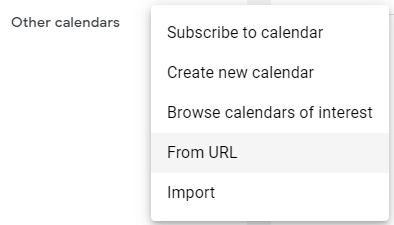
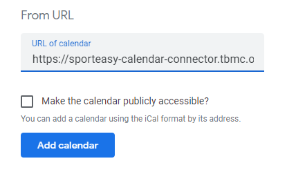

# SportEasy Calendar Connector

Generates ICS from SportEasy

## Simple and rapid use

1. Install ``Python3``
2. Populate ``.env`` with 
    ```Shell
    username: {your SportEasy username}
    password: {your SportEasy password}
   ```
3. **Optional**: Filter by team
   List teams with ``python3 list_teams.py`` and add `team_id={your team ID}` to `.env`
4. Run ``python3 env_to_base64.py`` and use `Default URL`

## Add SportEasy events to Google Calendar

1. Click here:



2. Paste generated default URL here



## Installation with Docker

Example `docker-compose.yml`:

```yml
version: "3"
services:
  sporteasy-calendar-connector:
     image: tbmc/sporteasy-calendar-connector:latest
     ports:
       - "5000:5000"
     volumes:
       - ./sporteasy-calendar-connector-logs:/logs
     restart: unless-stopped
```

Application listen on port `5000`.


The same image is available from 2 different registry:

| Host                                                                                                           | Docker image                                                                                             |
|----------------------------------------------------------------------------------------------------------------|----------------------------------------------------------------------------------------------------------|
| [ Github ]( https://github.com/tbmc/sporteasy-calendar-connector/pkgs/container/sporteasy-calendar-connector ) | [ ghcr.io/tbmc/sporteasy-calendar-connector:latest ]( ghcr.io/tbmc/sporteasy-calendar-connector:latest ) |
| [ Docker Hub ]( https://hub.docker.com/r/tbmc/sporteasy-calendar-connector )                                   | [ tbmc/sporteasy-calendar-connector ]( tbmc/sporteasy-calendar-connector )                               |

## How to use it

### Populate ``.env``

You need to populate ``.env`` with at least you SportEasy username and password.
You can also add ``team_id`` to only have event of only one team instead of all your teams.

To get all team names and IDs you can use ``list_teams.py`` after populating `username` and `password` in `.env`.

### Encode logins

#### With script

You can use ``env_to_base64.py`` script with `.env` populated. 

### Manually

#### Generate logins
Take json and transform it to base64, then url encode it
```json
{
    "username": "...",
    "password": "...",
    "team_id": 123456
}
```

``team_id`` is optional. 

## With my server

You can use mine, but at your own risk.

:warning: Data in base64 are not ciphered.

``
https://sporteasy-converter.***REMOVED***?data={base64Data}
``

## Info

SportEasy block IPs from server providers, so you should have a domestic IP.

